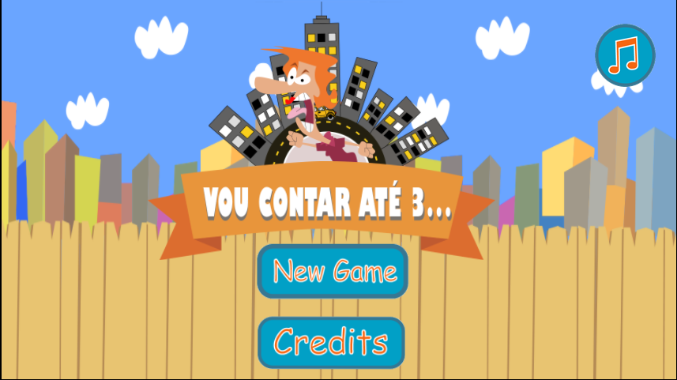

## Meu Portfólio

- Maria Eloísa
- 18 anos
- Estudante do IFRN-CM.

- Olá amigos, sejam bem vindos! Me chamo Maria eloisa, tenho 18 anos, sou aluna do IFRN campus Ceará-Mirim. Estou cursando o 3º ano do curso de Programção em Jogos Digitais.
- Adoro desenhar, criar, decorar, etc. 
- Meu sonho é fazer faculdade de arquitetura, porém acho que Design de Interiores é a melhor opção por enquanto.

# Contatos

1. Facebook: [Eloisa Gomes](https://www.facebook.com/profile.php?id=100012459307606)
2. Email: mariaeloisa0906@gmail.com
3. Instagram: Eloisaliima

## Jogos

Jogo 1: Maciellima.github.io/VouContarAte3/  
  
  
  
Jogo 2: CICEROC.github.io/GLOOMY CAMP/  
  
  
Jogo 3: eloisaliima.github.io/Estacoes/  

## Projetos

- Nuarte
Descrição; participei da monitoria do projeto de extensão NUARTE, esse projeto é destinado à área cultural e artística do campus. Densenvolvido pela professora Gislene Araujo.

- EcoArte
Descrição: Este projeto foi proporcionado pelo NUARTE, onde o objetivo era mostrar para a comunidade interna e externa do campus como desenvolver um ambiente mais sustentável. Os professores que se fizeram presente no dia da exposição puderam levar essa ideia para as escolas e suas crianças.

- Expotec
Descrição: Este projeto foi referente a matéria de física e uma atividade desenvolvida em sala, logo após, essa atividade virou projeto, o mesmo era sobre os foguetes, mais especificamente, como constuir foguetes de garrafas Pet. 

